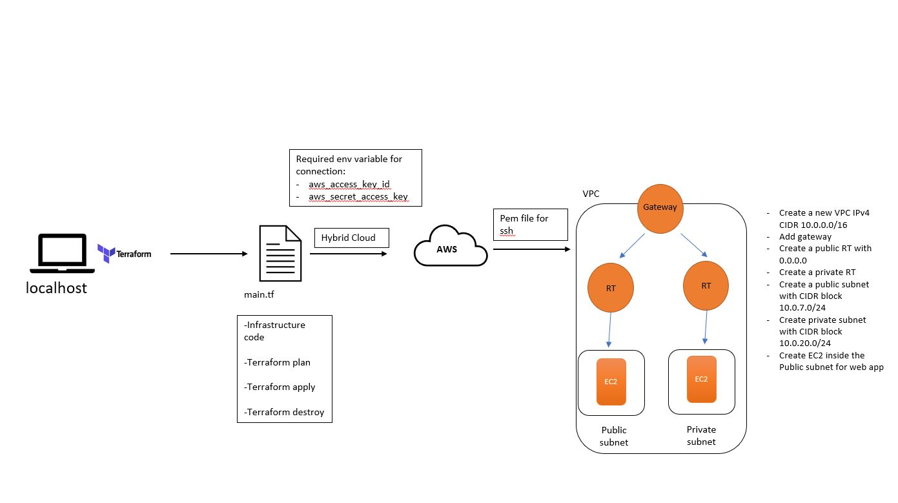

# Terraform


## Install Terraform
1. Go to `https://developer.hashicorp.com/terraform/downloads` to download Terraform installer and unzip the folder
2. Go to `https://chocolatey.org/install` to install chocolatey package manager
3. Open `Window Shell` terminal as Admin
4. Run the commands to install chocolatey ` Set-ExecutionPolicy Bypass -Scope Process -Force; [System.Net.ServicePointManager]::SecurityProtocol = [System.Net.ServicePointManager]::SecurityProtocol -bor 3072; iex ((New-Object System.Net.WebClient).DownloadString('https://community.chocolatey.org/install.ps1'))`
5. Use `choco install terraform` to install terraform
6. Use `terraform --version` to check the version and ensure it's installed

## Create env variables for AWS
1. Use this guide on how to create env variable `https://www.howtogeek.com/787217/how-to-edit-environment-variables-on-windows-10-or-11/#:~:text=To%20configure%20your%20environment%20variables%2C%20click%20the%20Start,a%20name%20and%20value%2C%20like%20%E2%80%9CNumber%20of%20processors.%E2%80%9D`
2. Create a first user env variable called `AWS_ACCESS_KEY_ID` where you paste an access key for your AWS account
3. Create a second user env variable called `AWS_SECRET_ACCESS_KEY` where you paste a secret key for your aws account
4. Restart the GitBash terminal
5. Use `printenv` in order to check if variables are there


## Provision EC2 instance
1. `cd` to your repo folder
2. Use `terraform init` to initialize the folder
3. Use `nano main.tf` to create a terraform provisioning file
4. Type in the following command:
```
# Terraform script to create a service on the cloud
# Let's set up our cloud provider with Terraform

# Who is the provider - AWS
# How to codify with terraform - syntax - name of the resource/task {key = value}
# most commonly used commands - terraform init - terraform plan - terraform apply - terraform >


provider "aws" {

        region = "eu-west-1"

}

# Create a service on AWS
# which service - EC2

resource "aws_instance" "app_instance"{
        # which ami to use
        #ami = "ami-id"
        ami = var.ami_id

        #type of instance
        instance_type = "t2.micro"

        # do you need the public IP
        associate_public_ip_address = true

        # what would you like to name it
        tags = {

          Name = "tech221_oleg_terraform_app"

        }

}

```
5. Use `terraform plan` to verify there are no error on your script
6. Use `terraform apply` to launch the instance
7. Check AWS to ensure that instance is running
8. You can use `terraform detsroy` in order to shut down EC2

### Create a varible to hide a sensative information

You can create a variable in order to hide a sensative information, such is IP address, AMI id etc.
For that:
1. Create a new file `variable.tf`
2. Create a variable following this format:
`
variable "<name>"{
    default = "<value>"
}
`
3. Add this file to `.gitignore`
4. Inside your `main.tf` file replace the value with a variable, for example: `ami = var.ami_id`


## Create a Hybrid infrastructure with a VPC



### Create a VPC

Use the following code to create a new VPC:
```
# Create a VPC on AWS

resource "aws_vpc" "tech221_oleg_terraform_vpc" {
  cidr_block = var.cidr_block
  instance_tenancy = "default"

  tags = {
    Name = "tech221_oleg_terraform_vpc"
  }
}
```

### Add a Gateway
```
# create a Gateway on AWS
resource "aws_internet_gateway" "tech221_oleg_terraform_gw" {
  vpc_id = aws_vpc.tech221_oleg_terraform_vpc.id

  tags = {
    Name = "tech221_oleg_terraform_gw"
  }
}
```

### Add a Public Route Table

```
# Create a public route table on AWS
resource "aws_route_table" "tech221_oleg_publicRT" {
  vpc_id = aws_vpc.tech221_oleg_terraform_vpc.id

  route {
    cidr_block = "0.0.0.0/0"
    gateway_id = aws_internet_gateway.tech221_oleg_terraform_gw.id
  }

  tags = {
    Name = "oleg_publicRT"
  }
}
```

### Create a Private Route Table
```
# Create a private route table on AWS
resource "aws_route_table" "tech221_oleg_privateRT" {
  vpc_id = aws_vpc.tech221_oleg_terraform_vpc.id

  tags = {
    Name = "oleg_privateRT"
  }
}
```

### Create a Public subnet
```
# Create a Public Subnet in VPC

resource "aws_subnet" "tech221_oleg_publicSubnet" {
	vpc_id = aws_vpc.tech221_oleg_terraform_vpc.id
	cidr_block = var.public_subnet_cidr_block
	map_public_ip_on_launch = "true"
	availability_zone = var.availability_zone

	tags = {
		Name = "tech221_oleg_publicSubnet"
	}

}
```

### Create a Private Subnet
```
# Create a Private Subnet in VPC

resource "aws_subnet" "tech221_oleg_privateSubnet" {
	vpc_id = aws_vpc.tech221_oleg_terraform_vpc.id
	cidr_block = var.private_subnet_cidr_block
	availability_zone = var.availability_zone

	tags = {
		Name = "tech221_oleg_privateSubnet"
	}

}
```

### Associate Public subnet to Public RT

```
# Creating Route association public Subnet

resource "aws_route_table_association" "oleg_public_association" {
	subnet_id = aws_subnet.tech221_oleg_publicSubnet.id
	route_table_id = aws_route_table.tech221_oleg_publicRT.id
}
```

### Associate Private subnet to Private RT

```
# Creating Route association private Subnet

resource "aws_route_table_association" "oleg_private_association" {
	subnet_id = aws_subnet.tech221_oleg_privateSubnet.id
	route_table_id = aws_route_table.tech221_oleg_privateRT.id
}
```

### Add Security Groups for the app

```
# Create a security group for App EC2

resource "aws_security_group" "tech221_oleg_AppSG" {
  name        = "security group for App"
  description = "security group for App"
  vpc_id      = aws_vpc.tech221_oleg_terraform_vpc.id

  ingress {
    description      = "HTTP"
    from_port        = 80
    to_port          = 80
    protocol         = "tcp"
    cidr_blocks      = ["0.0.0.0/0"]
    ipv6_cidr_blocks = ["::/0"]
  }

  ingress {
    description      = "port3000"
    from_port        = 3000
    to_port          = 3000
    protocol         = "tcp"
    cidr_blocks      = ["0.0.0.0/0"]
    ipv6_cidr_blocks = ["::/0"]
  }

  egress {
    from_port        = 0
    to_port          = 0
    protocol         = "-1"
    cidr_blocks      = ["0.0.0.0/0"]
    ipv6_cidr_blocks = ["::/0"]
  }

  tags = {
    Name = "tech221_oleg_AppSG"
  }
}
```

### Launch EC2 Instance inside Public subnet

```
resource "aws_instance" "app_instance"{
	# which ami to use
	ami = var.aim_id
	
	#type of instance
	instance_type = "t2.micro"

	# do you need the public IP
	associate_public_ip_address = true

	# Which subnet

	subnet_id = "${aws_subnet.tech221_oleg_publicSubnet.id}"

        # Add security groups

	security_groups = ["${aws_security_group.tech221_oleg_AppSG.id}"]

	# what would you like to name it
	tags = {
	
	  Name = "tech221_oleg_terraform_app"

	} 

}
```