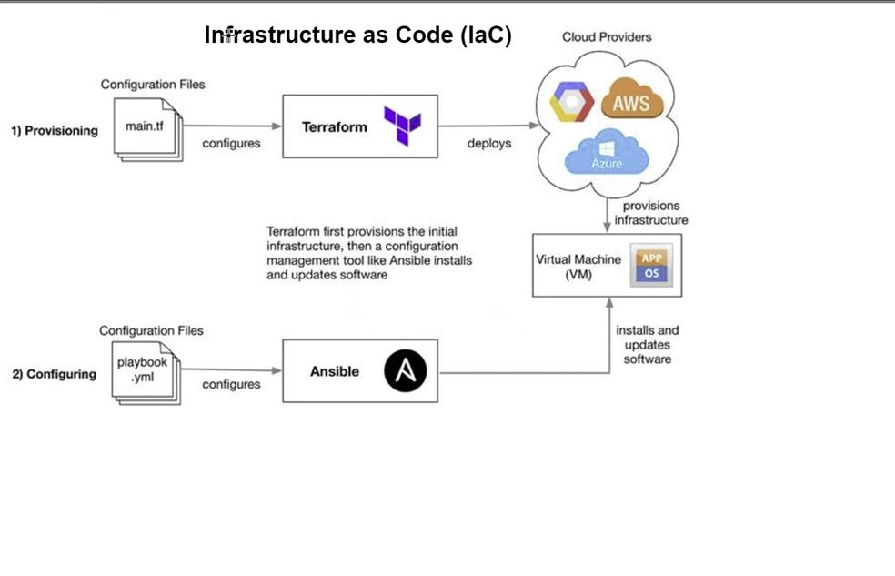

# Terraform



## Install Terraform
1. Go to `https://developer.hashicorp.com/terraform/downloads` to download Terraform installer and unzip the folder
2. Go to `https://chocolatey.org/install` to install chocolatey package manager
3. Open `Window Shell` terminal as Admin
4. Run the commands to install chocolatey ` Set-ExecutionPolicy Bypass -Scope Process -Force; [System.Net.ServicePointManager]::SecurityProtocol = [System.Net.ServicePointManager]::SecurityProtocol -bor 3072; iex ((New-Object System.Net.WebClient).DownloadString('https://community.chocolatey.org/install.ps1'))`
5. Use `choco install terraform` to install terraform
6. Use `terraform --version` to check the version and ensure it's installed

## Create env variables for AWS
1. Use this guide on how to create env variable `https://www.howtogeek.com/787217/how-to-edit-environment-variables-on-windows-10-or-11/#:~:text=To%20configure%20your%20environment%20variables%2C%20click%20the%20Start,a%20name%20and%20value%2C%20like%20%E2%80%9CNumber%20of%20processors.%E2%80%9D`
2. Create a first user env variable called `AWS_ACCESS_KEY_ID` where you paste an access key for your AWS account
3. Create a second user env variable called `AWS_SECRET_ACCESS_KEY` where you paste a secret key for your aws account
4. Restart the GitBash terminal
5. Use `printenv` in order to check if variables are there


## Provision EC2 instance
1. `cd` to your repo folder
2. Use `terraform init` to initialize the folder
3. Use `nano main.tf` to create a terraform provisioning file
4. Type in the following command:
```
# Terraform script to create a service on the cloud
# Let's set up our cloud provider with Terraform

# Who is the provider - AWS
# How to codify with terraform - syntax - name of the resource/task {key = value}
# most commonly used commands - terraform init - terraform plan - terraform apply - terraform >


provider "aws" {

        region = "eu-west-1"

}

# Create a service on AWS
# which service - EC2

resource "aws_instance" "app_instance"{
        # which ami to use
        #ami = "ami-id"
        ami = var.ami_id

        #type of instance
        instance_type = "t2.micro"

        # do you need the public IP
        associate_public_ip_address = true

        # what would you like to name it
        tags = {

          Name = "tech221_oleg_terraform_app"

        }

}

```
5. Use `terraform plan` to verify there are no error on your script
6. Use `terraform apply` to launch the instance
7. Check AWS to ensure that instance is running
8. You can use `terraform detsroy` in order to shut down EC2

### Create a varible to hide a sensative information

You can create a variable in order to hide a sensative
